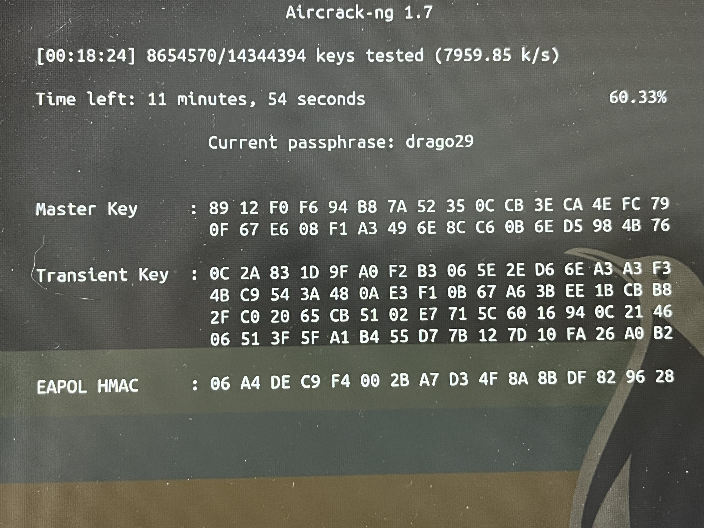

# Lanzar el ataque de comprobación con Aircrack-ng

[Volver al índice](../README.md)

---

## Ataque de fuerza bruta

Cuando tengas tu archivo `.pcap` con el handshake verificado y tu diccionario listo, el comando en la terminal de Ubuntu para probar si la clave está en la lista es:

```bash
aircrack-ng -w ~/path/path/worldlist/rockyou.txt -b XX:XX:XX:XX:XX:XX path/path/pcap/eapol_0.pcap

```

*(Sustituye `10:33:BF:21:36:F0` por la dirección MAC del router/Access Point que capturaste y ajusta las rutas según la ubicación de tus archivos).*

---

### Descripción de los parámetros utilizados:

* **`-w`**: Especifica la ruta absoluta o relativa hacia el archivo de diccionario (wordlist), como por ejemplo `rockyou.txt`, que contiene las contraseñas candidatas a probar.
* **`-b`**: Define el BSSID (dirección MAC) del punto de acceso objetivo para filtrar de forma estricta el tráfico correspondiente a esa red en concreto.
* **Ruta del `.pcap**`: El archivo de captura generado por el ESP32 Marauder (almacenado inicialmente en la raíz de la SD y movido a tu equipo) que incluye el *4-Way Handshake* validado (`1 handshake` detectado).

---

### Posibles resultados en pantalla:

1. **Éxito (`KEY FOUND!`):** Si la contraseña real de la red se encuentra dentro del diccionario probado, el proceso se detendrá de inmediato y mostrará un recuadro con la clave en texto plano.
2. **Fracaso (`Key not found`):** Si el contador llega al 100% o finaliza el archivo sin éxito, significará que la contraseña no estaba contenida en el diccionario utilizado y se requerirá una wordlist más amplia o específica.

<p align="center">
  
  <br>
  <em>Aircrack-ng 1.7  keys tested</em>
</p>